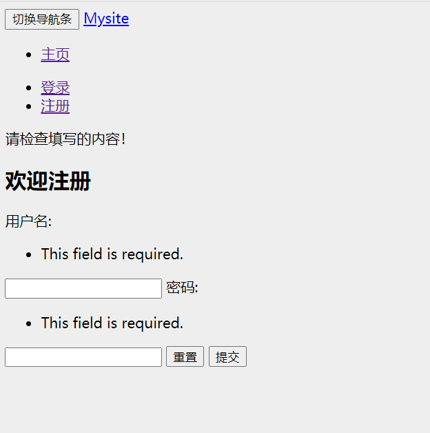
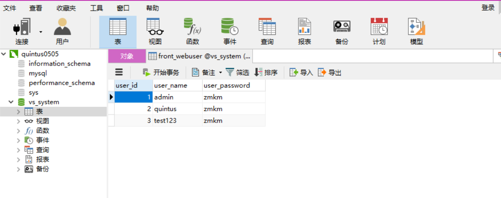
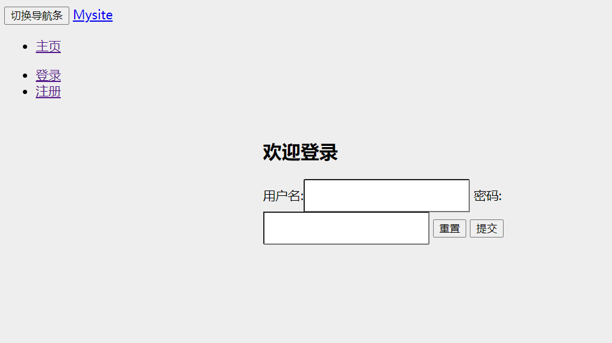
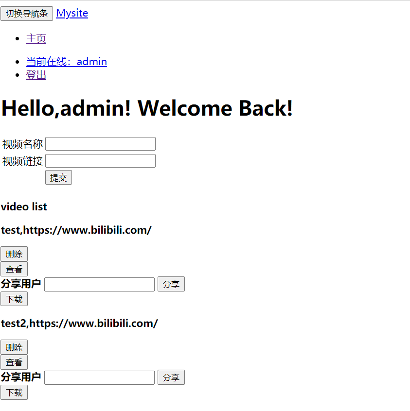
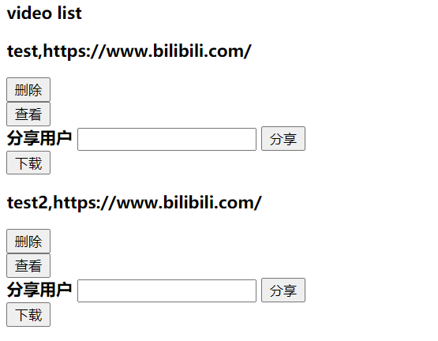
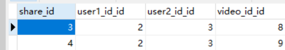
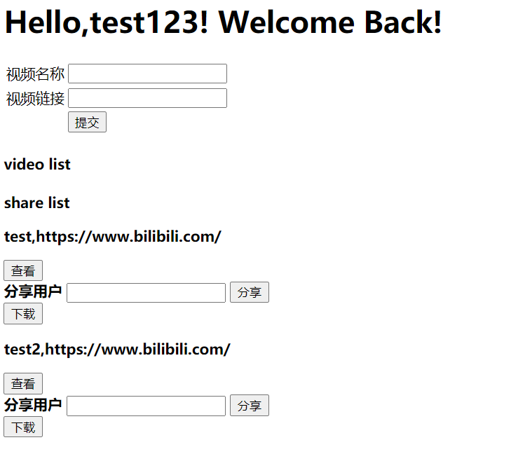
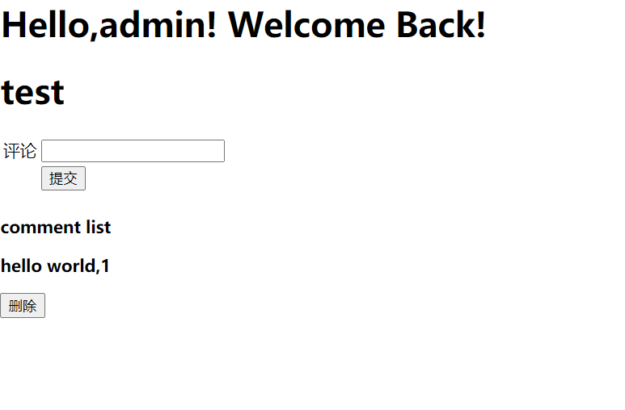
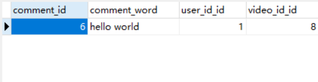
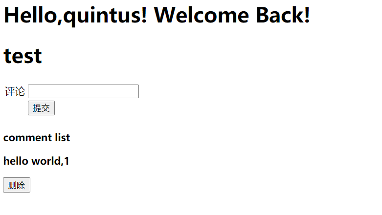

# 数据库LAB实验报告

**PB18111744朱昱钧**
**PB18111704朱恩佐**

[TOC]

使用Django搭建前后端，接MYSQL数据库，下面按照功能介绍实验

## 主要功能及其实现

### 用户身份管理

#### 注册
我们建立了一个web_user表，用于存储注册用户的相关信息:

**WebUser**
|字段名|标题|字段类|默认值|大小|
|-|-|-|-|-|
|user_id|用户编号|auto|Null|11|
|user_name|用户名称|str|Null|255|
|user_password|用户密码|str|Null|255|

注册的过程实际上就是向表中插入新的用户条目，user_id为自动生成，user_name，user_password为用户给出



注册完成后，表内成功插入用户信息



可以看到，目前系统中有三个用户

在python中我们实现了读入用户输入的信息并完成插入:
```python
def register(request):
    if request.method == "POST":
        register_form = UserForm(request.POST)
        message = "请检查填写的内容！"
        if register_form.is_valid():
            username = register_form.cleaned_data['username']
            password = register_form.cleaned_data['password']
            new_user=models.WebUser.objects.create()
            new_user.user_name=username
            new_user.user_password=password
            new_user.save()
        return render(request, 'register.html', locals())

    register_form = UserForm()
    return render(request, 'register.html')
```

html实现网页端的展示:
```html

    <div class="container">
        <div class="col-md-4 col-md-offset-4">
          <form class='form-register' action="/register/" method="post">

              
                  <div class="alert alert-warning">{{ message }}</div>
              
              
              <h2 class="text-center">欢迎注册</h2>

              {{ register_form }}

              <button type="reset" class="btn btn-default pull-left">重置</button>
              <button type="submit" class="btn btn-primary pull-right">提交</button>

          </form>
        </div>
    </div> <!-- /container -->

```

#### 登陆

直接通过代码讲解:
```python
def login(request):
    if request.session.get('is_login',None):
        return redirect('/user_home/')
    if request.method == "POST":
        login_form = UserForm(request.POST)
        message = "请检查填写的内容！"
        if login_form.is_valid():
            username = login_form.cleaned_data['username']
            password = login_form.cleaned_data['password']
            user=models.WebUser.objects.get(user_name=username)
            print(user)
            print(user.user_password)
            try:
                print("entered try")
                user=models.WebUser.objects.get(user_name=username)
                print(user)
                if user.user_password == password:
                    request.session['is_login']=True
                    request.session['user_id']=user.user_id
                    request.session['user_name']=user.user_name
                    return redirect('/user_home/')
                else:
                    message = "密码不正确！"
            except:
                message = "用户不存在！"
        return render(request, 'login.html', locals())

    login_form = UserForm()
    return render(request, 'login.html', locals())
```

主要的逻辑判断在中间的try部分，如果输入用户名在表中没有，输出"密码不存在"；如果用户存在，从表中读出对应用户的密码，和用户输入的密码进行比对以后确定是否登陆成功。

```html

    <div class="container">
        <div class="col-md-4 col-md-offset-4">
          <form class='form-login' action="/login/" method="post">

              
                  <div class="alert alert-warning">{{ message }}</div>
              
              
              <h2 class="text-center">欢迎登录</h2>

              {{ login_form }}

              <button type="reset" class="btn btn-default pull-left">重置</button>
              <button type="submit" class="btn btn-primary pull-right">提交</button>

          </form>
        </div>
    </div> <!-- /container -->

```

登陆成功界面:


#### 登出
```python
def logout(request):
    if not request.session.get('is_login',None):
        return redirect("/index/")
    request.session.flush()
    return redirect('/index/')
```

直接redirect到开始登陆的界面

### 视频

#### 上传视频

由于没有真正的视频，我们上传的是一个地址，如果这个地址是一个http开头的网页，则可以直接跳转过去

我们建立了一个video表，储存存在的video信息:
**Video**
|字段名|标题|字段类|默认值|大小|
|-|-|-|-|-|
|video_id|视频编号|auto|Null|11|
|video_name|视频名称|str|Null|255|
|video_address|视频地址|str|Null|255|

用户只能在登陆以后上传视频，video_id自动生成，用户只需要给出视频名称和地址

由于上传是在user_home中完成的，所有代码都位于user_home函数中，下面展示上传视频部分:
```python
    elif request.method == 'POST':
        if request.POST.get('upload'):
            name = request.POST.get("name")
            address = request.POST.get("address")
            owner = request.session['user_id']
            new_video = models.Video.objects.create(user_id_id=owner)
            new_video.video_name = name
            new_video.video_address = address
            new_video.save()
        # 跳转到首页
            owner = request.session['user_id']
            user_videos=models.Video.objects.filter(user_id_id=owner)
            return render(request,'user_home.html',locals())
```
如果是用户选择upload，系统会读入用户输入的视频名称和地址。视频的video_id自动生成，user_id为上传用户的id




#### 下载视频
由于没有真正的视频，点击下载按钮，会跳转到"视频"存放的地址
```html
<a href={{video.video_address}}><button>下载</button></a>
```

```python
    if request.method == 'GET':
        owner = request.session['user_id']
        if owner==1:
            user_videos=models.Video.objects.filter()
        else:
            user_videos=models.Video.objects.filter(user_id_id=owner)
        print(owner)
        shared_video_temp = models.Share.objects.filter(user2_id_id=owner).all()
        shared_videos = []
        for temp in shared_video_temp:
            shared_videos.extend(list(models.Video.objects.filter(video_id=temp.video_id_id)))

        print(shared_videos)

        return render(request,'user_home.html',locals())
```

#### 删除视频

只有视频是自己的或者管理员才可以进行删除操作，点击删除按钮，视频删除的同时，视频的评论、分享记录也会一起被删除:
```python
        elif request.POST.get('delete'):
            print("entered delete")
            id=request.POST.get("id")
            video=models.Video.objects.get(video_id=id)
            user=request.session['user_id']
            if user==1 or user==video.user_id:
                print("delete enabled")
                models.Video.objects.filter(video_id=id).delete();
            else:
                print("delete disabled")
            owner = request.session['user_id']
            user_videos=models.Video.objects.filter(user_id_id=owner)
            return render(request,'user_home.html',locals())
```
通过主码video_id，删除视频

#### 分享视频

我们为分享操作建立了一个表，分享操作就是向表中插入分享数据:


在home_page下面，有一个share list,可以查看被分享的视频


```python
        elif request.POST.get('share'):
            print("entered share")
            owner = request.session['user_id']
            id=request.POST.get("id")
            target_user=request.POST.get("user")
            try:
                origin_user=models.WebUser.objects.get(user_id=owner)
                origin_user_id=origin_user.user_id
                target_user=models.WebUser.objects.get(user_name=target_user)
                print(1)
                target_user_id=target_user.user_id
                print(2)
                new_share=models.Share.objects.create(user1_id_id=origin_user_id,user2_id_id=target_user_id,video_id_id=id)
                print(3)
                print("share saved")
            except:
                print("share failed")
                message="分享出现错误，请检查目标用户名"
            user_videos=models.Video.objects.filter(user_id_id=owner)
            return render(request,'user_home.html',locals())
```

其中，user1_id_id为发起分享的用户id,user2_id_id为被分享用户的id,通过级联查找，输入用户的名字，就可以插入对应的id

### 评论

#### 添加评论

点击视频下面的查看按钮，可以进入评论区域:


评论我们也单独建立了一个comment表:


```python
        if request.POST.get('upload'):
            cur_url=str(request.path)
            splited_url=cur_url.split('/')
            id=splited_url[-1]
            video=models.Video.objects.get(video_id=id)
            comment = request.POST.get("comment")
            owner = request.session['user_id']
            new_comment = models.Comment.objects.create(user_id_id=owner,video_id_id=id)
            new_comment.comment_word = comment
            new_comment.save()
            comments=models.Comment.objects.filter(video_id_id=id)
        # 跳转到首页
            return render(request,'video.html',locals())
```

系统从用户得到评论的内容并插入表

用其他用户登陆，也可以看到视频的评论


#### 删除评论
和删除视频一样，除非评论是自己的或者是管理员，否则无法删除评论:
```python
            print("entered delete")
            id=request.POST.get("id")
            comment=models.Comment.objects.get(comment_id=id)
            user=request.session['user_id']
            if user==1 or user==comment.user_id:
                print("delete enabled")
                models.Comment.objects.filter(comment_id=id).delete();
            else:
                print("delete disabled")
            owner = request.session['user_id']
            comments=models.Comment.objects.filter(video_id_id=id)
            return render(request,'video.html',locals())
```

## 实验流程及分工

由于两个人第一次接触，只有一个人以前了解过html，所以代码部分朱恩佐完全书写了.html部分，python部分由两个人共同完成。由于整体工作量比较少，没有采用分布式开发，写代码的时候为两个人轮流书写(一人coding一人旁边观看帮忙查资料和debug)，文档部分由朱昱钧完成。

开始先在CSDN上查找了一个Django图书管理系统例子，按照教程完成了一遍后再在其基础上添加修改，变成最终的版本。